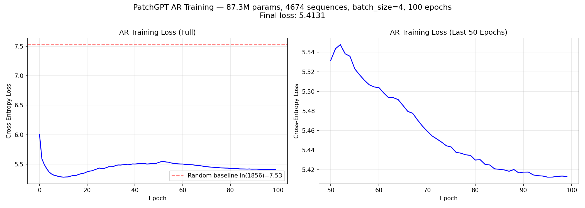

# PatchGPT AR Training Report

## Training Configuration

| Parameter | Value |
|-----------|-------|
| Model | PatchGPT (GPT-2 style decoder-only Transformer) |
| Parameters | 87.3M |
| d_model | 768 |
| n_heads | 12 |
| n_layers | 12 |
| max_seq_len | 1024 |
| Vocab size | 1856 (3×256 pos + 64 scale + 1024 codebook) |
| Optimizer | AdamW (lr=3e-4, weight_decay=0.01) |
| Scheduler | CosineAnnealingLR (T_max=100) |
| Batch size | 4 (受限于 RTX 4090 24GB 显存) |
| Epochs | 100 |
| Training time | 3.1h (~111s/epoch) |
| GPU | RTX 4090, ~4.9GB VRAM |

## Training Data

| Item | Value |
|------|-------|
| Sequences | 4674 (每个 mesh 一条) |
| Source | Objaverse-LVIS, 1061 categories |
| Token format | 7 tokens/patch: (pos_x, pos_y, pos_z, scale, tok_L1, tok_L2, tok_L3) |
| Avg patches/mesh | ~50 (range: 10-200+) |
| Avg seq length | ~350 tokens |
| Spatial ordering | Morton (Z-order) curve |

## Loss Curve

| Milestone | Loss |
|-----------|------|
| Epoch 0 | 6.007 |
| Epoch 10 | 5.770 |
| Epoch 50 | 5.532 |
| Epoch 80 | 5.425 |
| Epoch 99 (final) | 5.413 |
| Random baseline | 7.526 (ln(1856)) |

## Analysis

### 收敛状态

Loss 在最后 ~20 epochs 已经 plateau（5.42→5.41），确认是最终收敛值而非中途快照。
相比 random baseline 7.53，模型将 perplexity 从 1856 降到了 e^5.41 ≈ 224，说明学到了 patch 序列的统计规律。

### Loss 偏高的原因分析

1. **数据量不足**: 4674 个 mesh 对 87.3M 参数模型来说偏少。典型 GPT-2 训练需要 token 数 >> 参数数，而我们只有 ~1.6M tokens (4674 × 350)，远小于 87.3M 参数。模型处于严重欠拟合状态。

2. **Batch size 过小**: batch_size=4 导致梯度估计噪声大，配合 cosine schedule 衰减过快，模型可能没有充分优化。理想 batch_size 应为 32-64。

3. **序列结构复杂**: 每个 patch 的 7 个 token 混合了空间位置（连续量化）和 codebook index（离散），模型需要同时学习空间分布和形状分布，难度较高。

4. **无条件生成**: 当前是无条件生成（unconditional），没有类别或文本条件引导，模型需要覆盖所有 1061 个类别的分布。

### 改进方向

- 增加训练数据（使用完整 Objaverse 而非仅 LVIS 子集）
- 使用 gradient accumulation 模拟更大 batch size
- 添加类别条件（class-conditional generation）
- 减小模型规模以匹配数据量（如 6 层 d_model=512, ~25M params）
- 更长的训练（200-500 epochs）配合更慢的 lr schedule

## Generation Results

使用 temperature=0.9, top_k=50 生成了 5 个 mesh：
- 每个 mesh 生成 130 patches（910 tokens / 7 tokens per patch）
- 生成结果保存为 point cloud (.ply) 在 `results/generated/`
- 生成质量受限于 AR loss，patch 空间分布可能不够连贯
