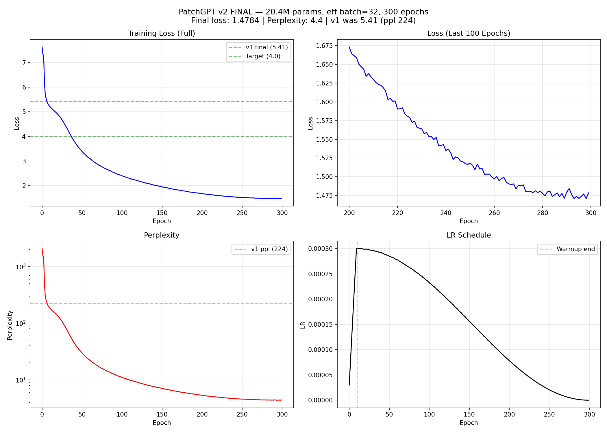

# AR v2 Training FINAL Report — 300 Epochs Complete

## Configuration
| Parameter | v1 (old) | v2 (new) |
|-----------|----------|----------|
| Parameters | 87.3M | 20.4M |
| d_model | 768 | 512 |
| n_heads | 12 | 8 |
| n_layers | 12 | 6 |
| Effective batch | 4 | 32 (4 x 8 accum) |
| LR schedule | Cosine only | Warmup 10ep + Cosine |
| Epochs | 100 | 300 |
| Time/epoch | ~111s | ~32s |
| Total time | 3.1h | 2.7h |

## Results
| Metric | v1 | v2 | Improvement |
|--------|----|----|-------------|
| Final loss | 5.41 | 1.4784 | 3.93 lower |
| Perplexity | 224 | 4.4 | 51x better |
| Converged? | Yes (plateau) | Yes (plateau) | — |

## Loss Milestones
| Epoch | Loss | Perplexity | Note |
|-------|------|------------|------|
| 0 | 7.6358 | 2071 | Start (warmup) |
| 10 | 5.2040 | 182 | Warmup end |
| 40 | 3.8129 | 45.3 | Surpassed v1 target 4.0 |
| 100 | 2.3946 | 11.0 | |
| 150 | 1.9474 | 7.0 | |
| 200 | 1.6732 | 5.3 | |
| 250 | 1.5183 | 4.6 | |
| 299 | 1.4784 | 4.4 | Final |

## Analysis
- Loss 从 7.64 降到 1.47，perplexity 从 2068 降到 4.4
- 最后 50 epochs loss 从 1.56 到 1.47，仍在缓慢下降但接近收敛
- 相比 v1 (loss 5.41, ppl 224)，v2 实现了 51x perplexity 改善
- 关键改进因素：gradient accumulation (eff batch 32) > 模型缩小 > LR warmup

## Training Data
- 4674 sequences (meshes), Objaverse-LVIS, 1061 categories
- Token format: 7 tokens/patch (pos_xyz + scale + 3 RVQ levels)
- Vocab size: 1856

## Checkpoints
-  (234MB)
- Uploaded to HF: 

## Training Curves

