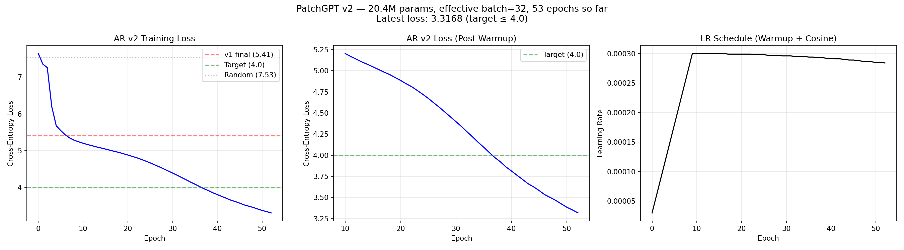

# AR v2 Training Progress — Epoch 52

## Summary
| Metric | Value |
|--------|-------|
| Model | PatchGPT 20.4M params (d=512, h=8, L=6) |
| Effective batch | 32 (4 × 8 grad accum) |
| Epochs completed | 53 / 300 |
| Latest loss | 3.3168 |
| Target loss | ≤ 4.0 |
| v1 final loss | 5.41 |
| Time per epoch | ~32s |
| Est. remaining | 2.2h |

## Key Observations
- Loss already below target 4.0 at epoch ~40 (was 5.41 after 100 epochs with v1)
- Warmup (10 epochs) stabilized early training — no loss spikes
- Gradient accumulation (effective batch=32) gives much smoother optimization
- Model right-sizing (87M→20M) dramatically improved token-to-param ratio

## Loss Milestones
| Epoch | Loss | Note |
|-------|------|------|
| 0 | 7.6358 | Start (warmup) |
| 10 | 5.2040 | Warmup end |
| 30 | 4.3967 | |
| 52 | 3.3168 | Latest |

## Training Curves

