# Dry-Run Dataset Pipeline Visualization

**Date:** 2026-03-20

## Dataset Summary

- Total meshes: 53
- Total patches: 2997
- Sources: {'shapenet': np.int64(2964), 'objaverse': np.int64(33)}
- Categories: ['Band_Aid', 'rocket']

## Visualizations

### Statistics
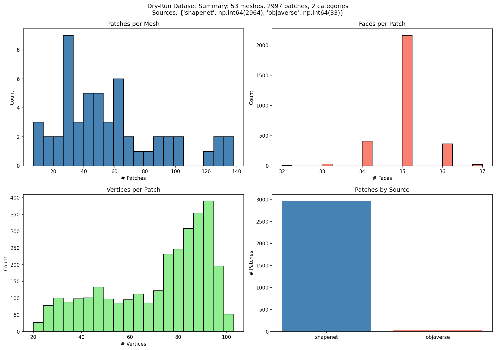

### Objaverse Samples

#### d4c9180a46cf401f...
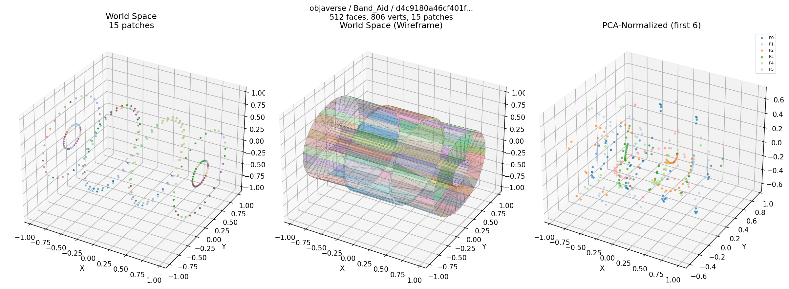
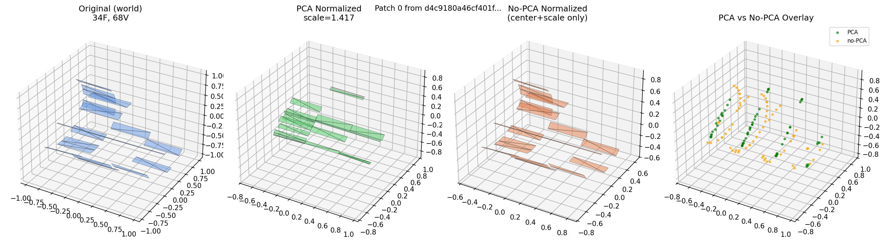

#### dc19a68329ab435f...
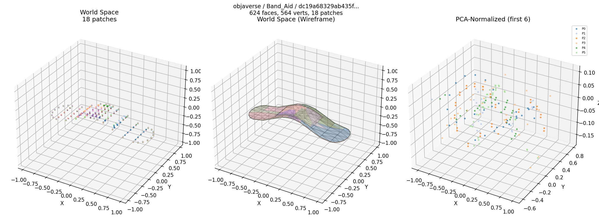
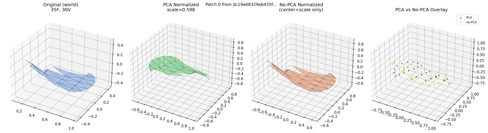

### ShapeNet Samples

#### 04099429_15474cf9caa...
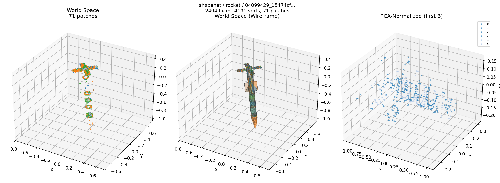
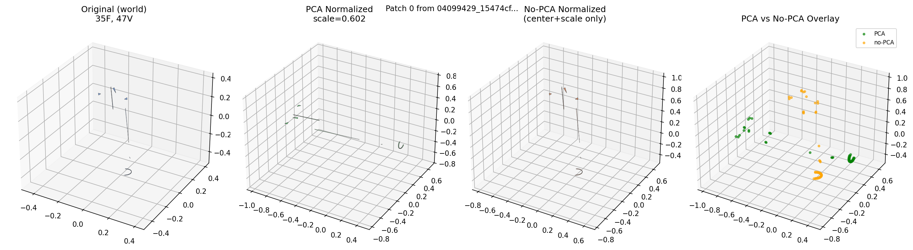

#### 04099429_1a3ef9b0c9c...
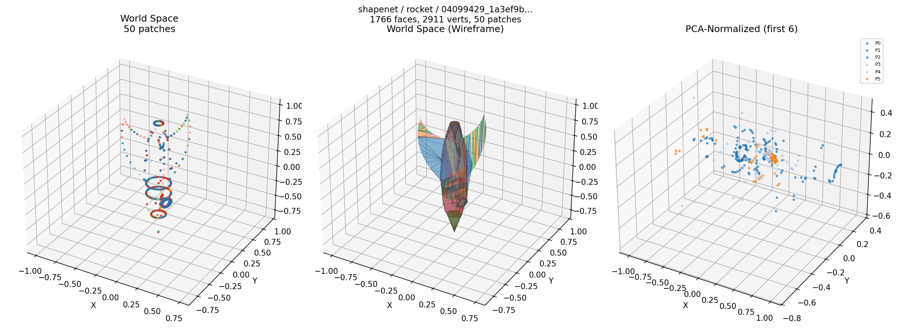
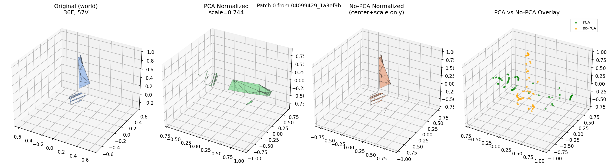

#### 04099429_1ab4a282a80...
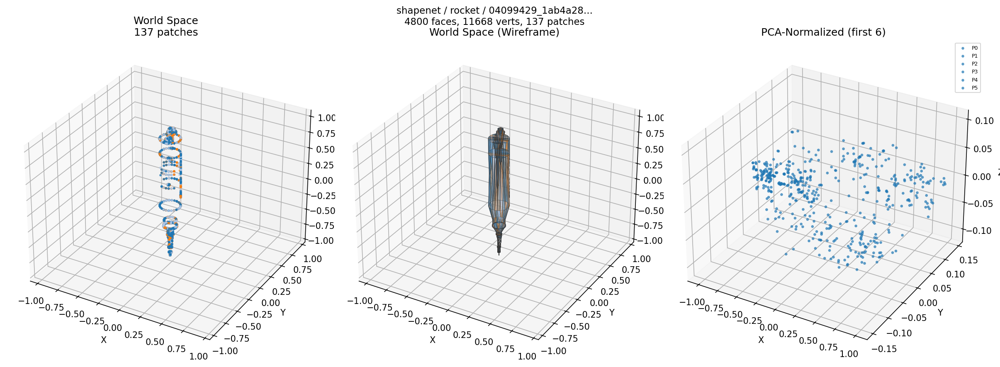
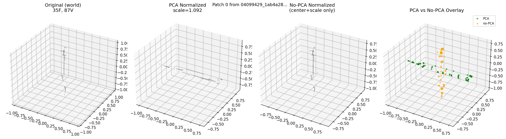

#### 04099429_2407c2684ee...
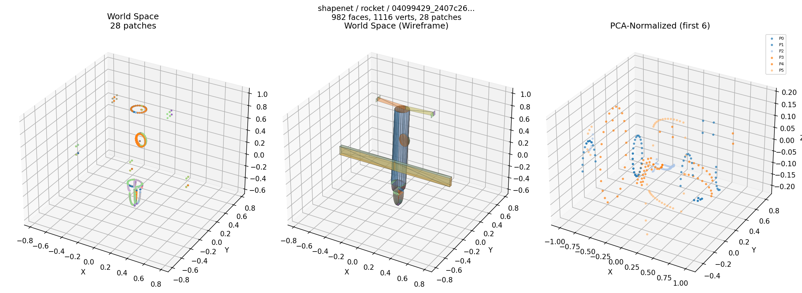
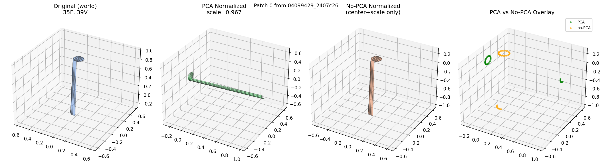

#### 04099429_24d392e5178...
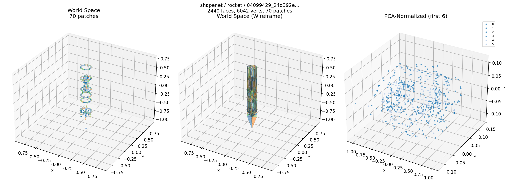
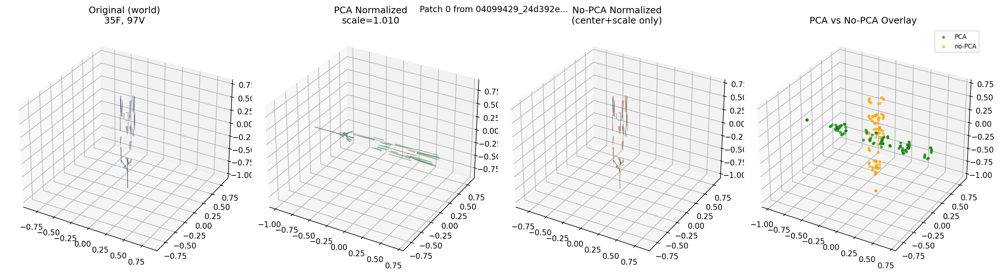

#### 04099429_3c43ddee5e1...
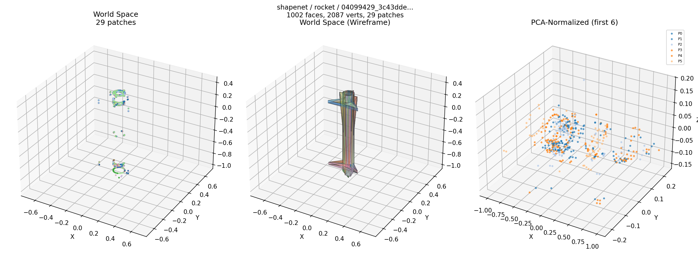
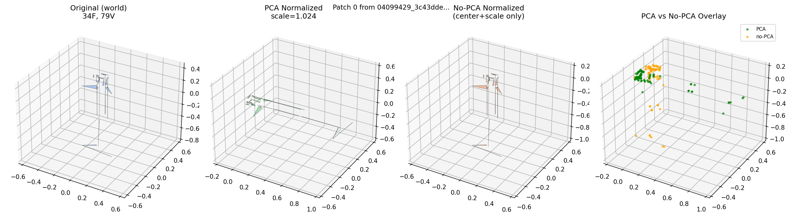

#### 04099429_3e75a7a2f8f...
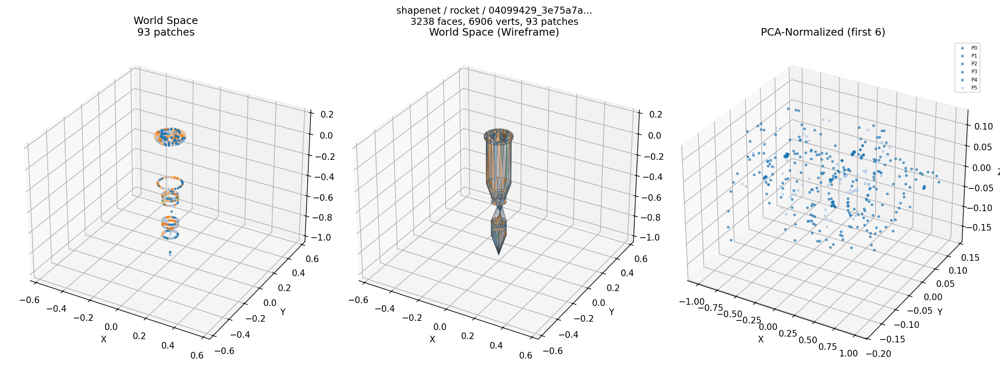
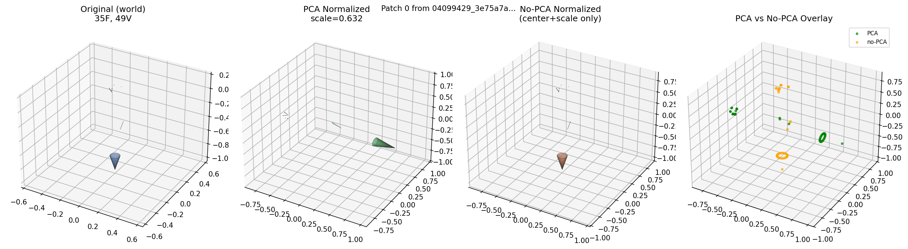

#### 04099429_3f3232433c2...
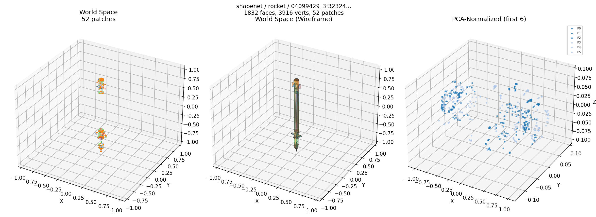
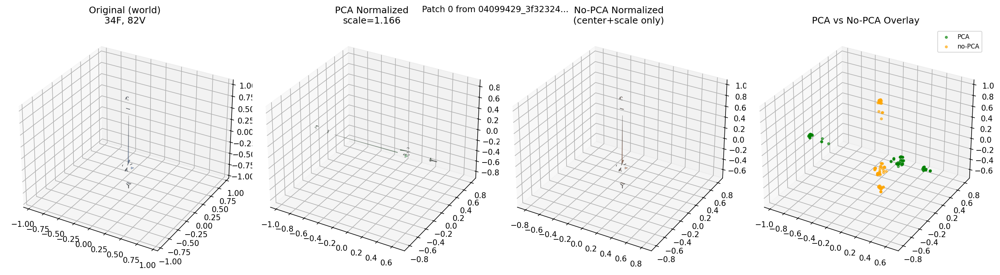

#### 04099429_4c553d60964...
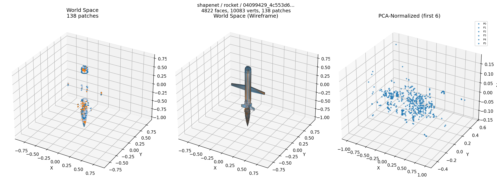
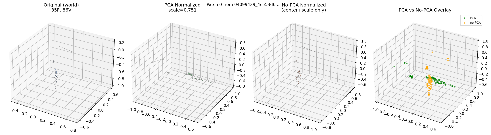

#### 04099429_53009165a8a...
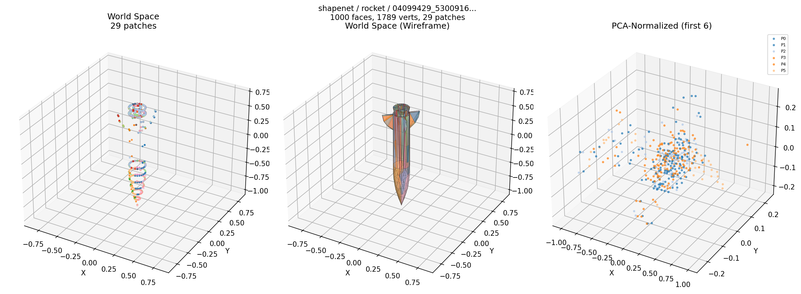
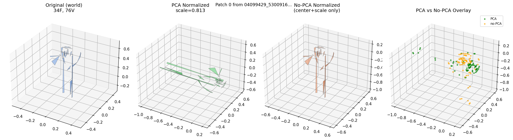

### Processing Pipeline
Shows: World Space → Centered → PCA Rotated → PCA+Scale → No-PCA+Scale

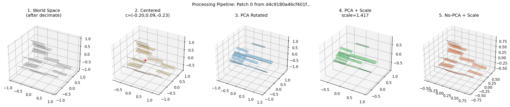
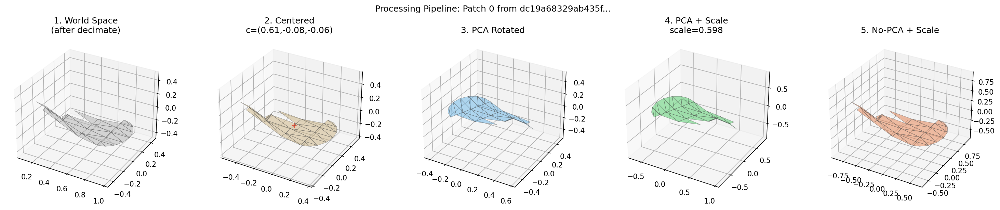
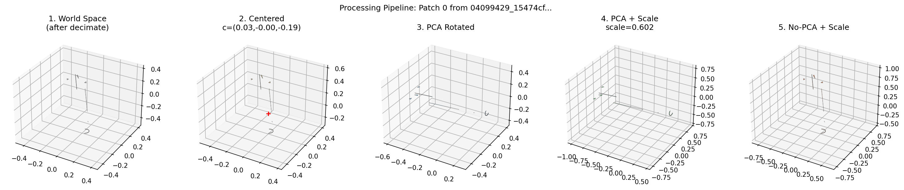
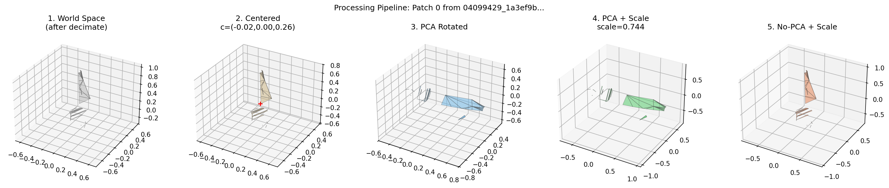
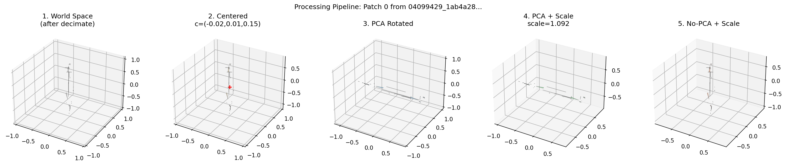
