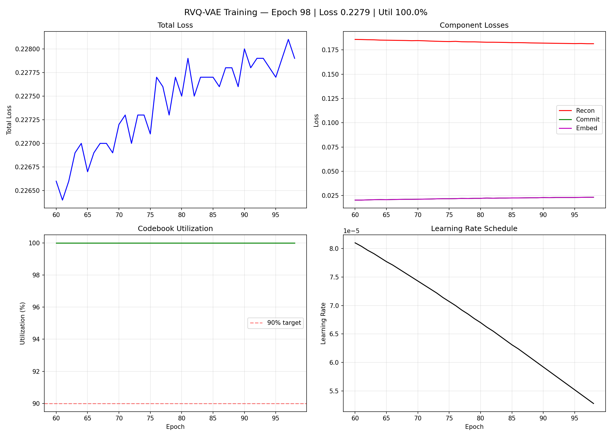
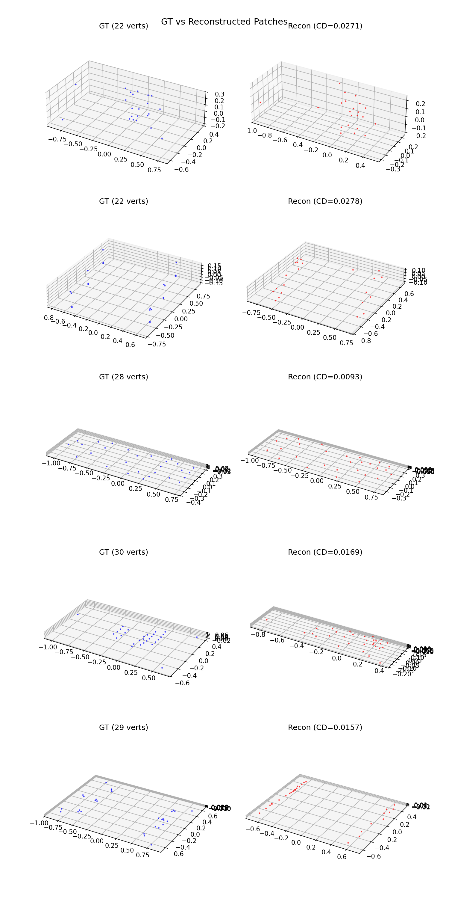

# RVQ-VAE Training Progress — 20260318_2113

## Summary
- Epochs completed: 99
- Latest loss: 0.2279
- Recon loss: 0.1814
- Commit loss: 0.0233
- Embed loss: 0.0233
- Codebook utilization: 100.0%
- Learning rate: 5.28e-05
- Time per epoch: 196.0s

## Training Curves

## Reconstruction Samples

## Epoch History (last 10)
| Epoch | Loss | Recon | Commit | Embed | Util | LR |
|-------|------|-------|--------|-------|------|----|
|  89 | 0.2276 | 0.1821 | 0.0228 | 0.0228 | 100.0% | 6.00e-05 |
|  90 | 0.2280 | 0.1820 | 0.0230 | 0.0230 | 100.0% | 5.92e-05 |
|  91 | 0.2278 | 0.1819 | 0.0229 | 0.0229 | 100.0% | 5.84e-05 |
|  92 | 0.2279 | 0.1818 | 0.0231 | 0.0231 | 100.0% | 5.76e-05 |
|  93 | 0.2279 | 0.1817 | 0.0231 | 0.0231 | 100.0% | 5.68e-05 |
|  94 | 0.2278 | 0.1816 | 0.0231 | 0.0231 | 100.0% | 5.60e-05 |
|  95 | 0.2277 | 0.1815 | 0.0231 | 0.0231 | 100.0% | 5.52e-05 |
|  96 | 0.2279 | 0.1816 | 0.0232 | 0.0232 | 100.0% | 5.44e-05 |
|  97 | 0.2281 | 0.1814 | 0.0233 | 0.0233 | 100.0% | 5.36e-05 |
|  98 | 0.2279 | 0.1814 | 0.0233 | 0.0233 | 100.0% | 5.28e-05 |
