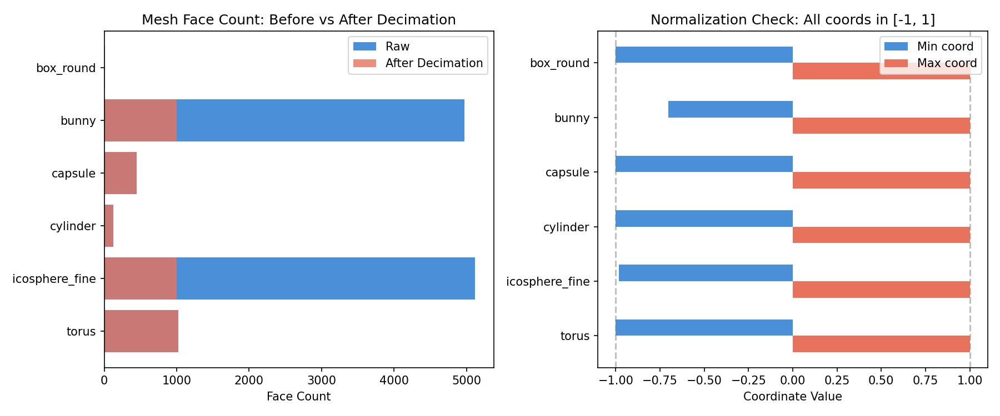
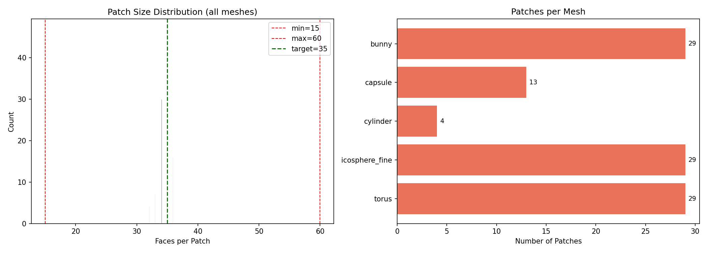
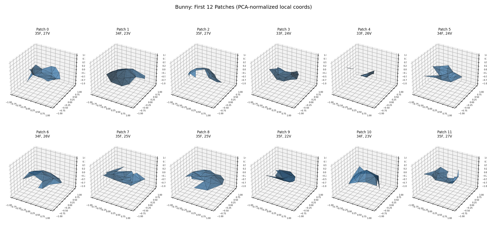

# Task 1-3 Validation Report

**Date:** 2026-03-07 08:01:27

## Data Preprocessing (Task 2)

| Mesh | Raw Faces | Processed Faces | Raw Verts | Processed Verts | Time |
|------|-----------|-----------------|-----------|-----------------|------|
| box_round | 12 | 12 | 8 | 8 | 0.001s |
| bunny | 4968 | 1000 | 2503 | 519 | 0.012s |
| capsule | 448 | 448 | 226 | 226 | 0.001s |
| cylinder | 128 | 128 | 66 | 66 | 0.001s |
| icosphere_fine | 5120 | 1000 | 2562 | 502 | 0.009s |
| torus | 1024 | 1024 | 512 | 512 | 0.001s |

All meshes normalized to [-1, 1] bounding box, centered at origin.

## Patch Segmentation (Task 3)

| Mesh | Patches | Min Faces | Max Faces | Median | Coverage |
|------|---------|-----------|-----------|--------|----------|
| bunny | 29 | 33 | 35 | 35 | 100.0% |
| capsule | 13 | 34 | 35 | 34 | 100.0% |
| cylinder | 4 | 32 | 32 | 32 | 100.0% |
| icosphere_fine | 29 | 33 | 35 | 35 | 100.0% |
| torus | 29 | 34 | 36 | 36 | 100.0% |

### Bunny Patch Examples (PCA-normalized local coordinates)

## Conclusion

- Data prep pipeline correctly loads, decimates, and normalizes meshes
- Patch segmentation produces patches in the [15, 60] face range
- 100% face coverage: every face assigned to exactly one patch
- PCA normalization produces well-centered local coordinates within unit sphere