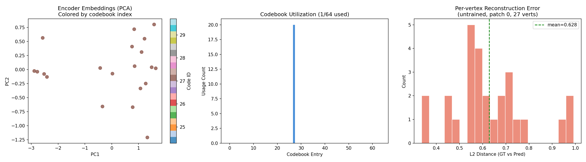
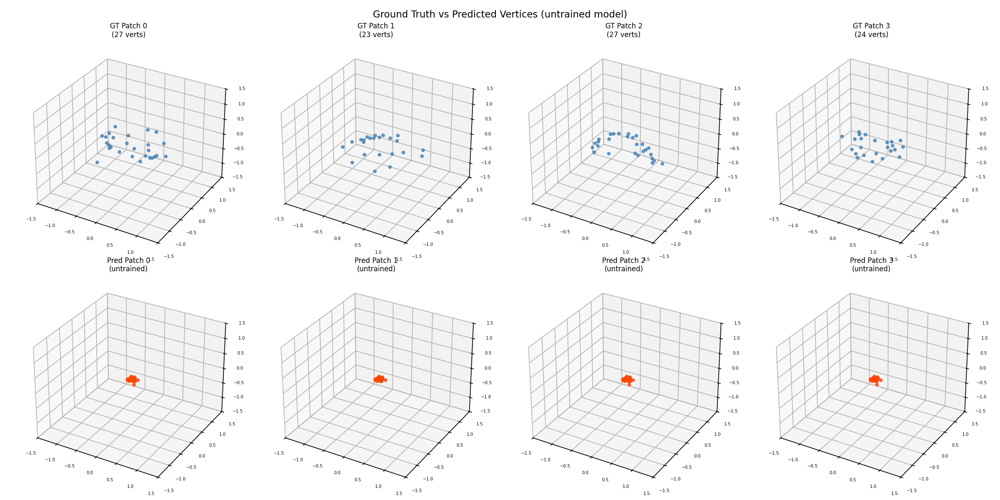

# Task 5-7 Validation Report

**Date:** 2026-03-07 08:40:02

## GNN Encoder (Task 5)

- 4-layer SAGEConv, 15→256→256→256→128
- Input: 685 face nodes, 1770 edges
- Output: (20, 128) patch embeddings
- Embedding stats: mean=0.2844, std=0.5207

## SimVQ Codebook (Task 6)

- K=64, dim=128
- Codes used: 1/64 (1.6%)
- Straight-through gradient: working

## Patch Decoder (Task 7)

- Cross-attention + MLP, max_vertices=60
- Output: (20, 60, 3) with correct masking

## Full Pipeline (untrained)

- recon_loss = 0.0478
- commit_loss = 0.3103
- embed_loss = 0.3103
- total_loss = 0.4356
- All gradients flow correctly

## Visualizations

## Conclusion

- Encoder correctly produces per-patch embeddings from face graphs
- SimVQ codebook quantizes with straight-through gradients and non-trivial utilization
- Decoder reconstructs vertex coordinates with proper masking
- Full pipeline forward+backward pass works end-to-end